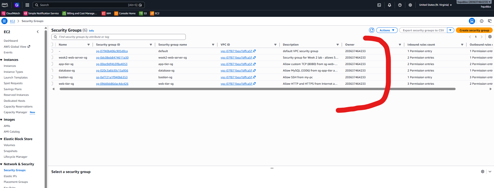
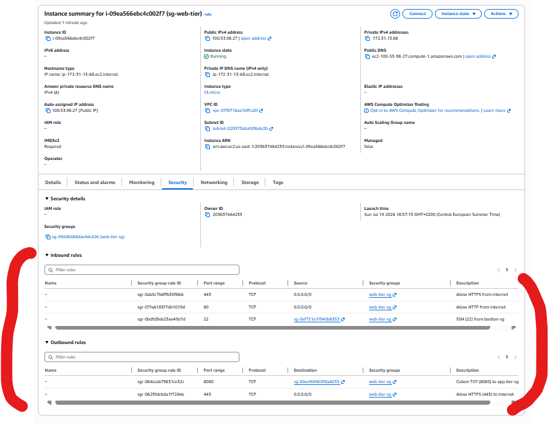
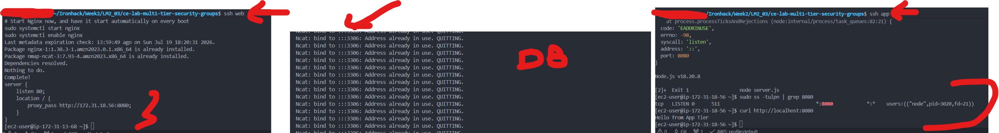
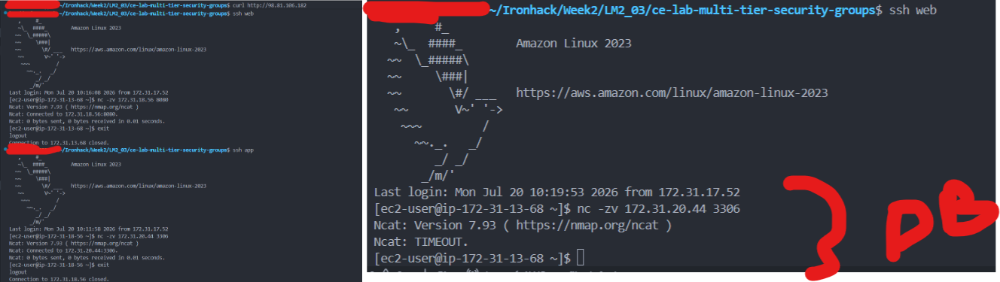
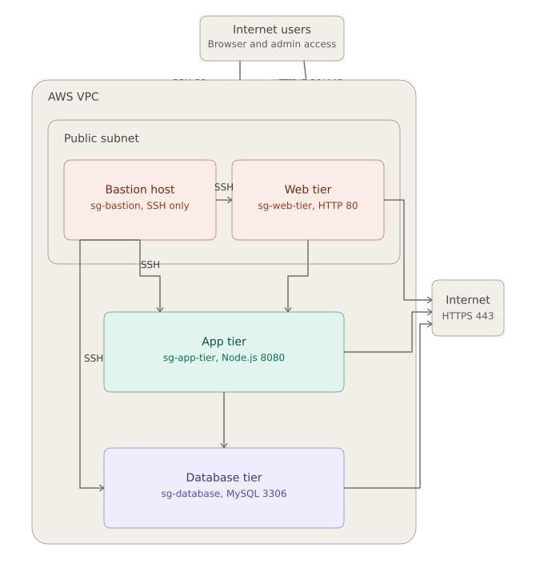

# Configure Multi-Tier Security Groups Lab - Solution

**Student Name:** [Your Name]  
**Date Completed:** [Date]

---

# Environment Details

| Tier | Instance ID | Private IP | Public IP | Security Group |
|------|-------------|------------|-----------|----------------|
| Bastion | [i-xxxxxxxxxxxxx] | [10.x.x.x] | [x.x.x.x — redact if repo is public] | [sg-bastion] |
| Web | [i-xxxxxxxxxxxxx] | [10.x.x.x] | [x.x.x.x] | [sg-web-tier] |
| App | [i-xxxxxxxxxxxxx] | [10.x.x.x] | [none] | [sg-app-tier] |
| Database | [i-xxxxxxxxxxxxx] | [10.x.x.x] | [none] | [sg-database] |

- **Region / VPC:** [eu-west-1 / vpc-xxxxxxxx]
- **Key Pair:** [bootcamp-week2-key.pem]
- **My IP (SSH source):** [x.x.x.x/32]

---

# Step 1: Create Security Groups

## Screenshot 1 – Security Groups List

Save your screenshot as:

```
screenshots/01-security-groups-list.png
```



---

- [ ] `sg-bastion` created
- [ ] `sg-web-tier` created
- [ ] `sg-app-tier` created
- [ ] `sg-database` created
- [ ] Rules reference other **security groups**, not IP ranges (except port 22 on the bastion and 80/443 on the web tier)

### sg-bastion

| Direction | Port | Source / Destination | Purpose |
|-----------|------|----------------------|---------|
| Inbound | [22] | [YOUR_IP/32] | [SSH from my laptop] |
| Outbound | [22] | [sg-web-tier, sg-app-tier, sg-database] | [Hop to private tiers] |

### sg-web-tier

| Direction | Port | Source / Destination | Purpose |
|-----------|------|----------------------|---------|
| Inbound | [80] | [0.0.0.0/0] | [Public HTTP] |
| Inbound | [443] | [0.0.0.0/0] | [Public HTTPS] |
| Inbound | [22] | [sg-bastion] | [SSH via bastion only] |
| Outbound | [8080] | [sg-app-tier] | [Proxy to app tier] |
| Outbound | [443] | [0.0.0.0/0] | [Package downloads] |

### sg-app-tier

| Direction | Port | Source / Destination | Purpose |
|-----------|------|----------------------|---------|
| Inbound | [8080] | [sg-web-tier] | [App traffic from web tier] |
| Inbound | [22] | [sg-bastion] | [SSH via bastion only] |
| Outbound | [3306] | [sg-database] | [MySQL queries] |
| Outbound | [443] | [0.0.0.0/0] | [Package downloads] |

### sg-database

| Direction | Port | Source / Destination | Purpose |
|-----------|------|----------------------|---------|
| Inbound | [3306] | [sg-app-tier] | [MySQL from app tier only] |
| Inbound | [22] | [sg-bastion] | [SSH via bastion only] |
| Outbound | [443] | [0.0.0.0/0] | [Package downloads] |

---

### Why reference a security group instead of a private IP or CIDR?

**Your Answer**

```
_______________________________________________________________

_______________________________________________________________

_______________________________________________________________
```

---

# Step 2: Launch Instances and Connect Through the Bastion

## Screenshot 2 – Web Tier Security Group Rules

Save your screenshot as:

```
screenshots/02-web-tier-rules.png
```



---

- [ ] 4 instances launched, one security group each
- [ ] Connected to the bastion from my laptop
- [ ] Reached web / app / db by **private IP** through the bastion

---

### Which connection method did you use?

- [ ] ProxyJump
- [ ] Copy key to bastion

---

### My `~/.ssh/config` (or the commands I ran)

```text
[Paste your host entries or SSH commands here]
```

---

### Why must you target the private tiers by private IP instead of public IP?

**Your Answer**

```
_______________________________________________________________

_______________________________________________________________

_______________________________________________________________
```

---
# Step 3: Simulate Application Traffic

## Screenshot 3 – Services Running

Save your screenshot as:

```
screenshots/03-services-running.png
```



---

- [ ] Database: `nc -l 3306` loop running (`nmap-ncat` installed)
- [ ] App: `server.js` listening on 8080 (`nodejs` installed)
- [ ] Web: Nginx installed, proxying `/` to `http://APP_PRIVATE_IP:8080`, enabled on boot

### Anything that did not start cleanly?

**Your Answer**

```
_______________________________________________________________

_______________________________________________________________

_______________________________________________________________
```

---

# Step 4: Test Traffic Flow

## Screenshot 4 – Traffic Flow Test

Save your screenshot as:

```
screenshots/04-traffic-flow-test.png
```



---

**Reading results:** *connection refused* = the security group **allowed** the packet but nothing was listening. *Timeout / hang* = the security group **blocked** the packet.

Tick the box if the test did what the **Expected** column says.

| # | Test | Run from | Expected | Got it |
|---|------|----------|----------|--------|
| 1 | `curl http://WEB_PUBLIC_IP` | Laptop | ✅ HTTP 200 | [ ] |
| 2 | `ssh bastion`, then `ssh WEB_PRIVATE_IP` | Laptop → bastion | ✅ Connects | [ ] |
| 3 | `ssh ec2-user@WEB_PUBLIC_IP` | Laptop | ❌ Timeout | [ ] |
| 4 | `nc -zv APP_PRIVATE_IP 8080` | Web | ✅ Succeeds | [ ] |
| 5 | `nc -zv DB_PRIVATE_IP 3306` | App | ✅ Succeeds | [ ] |
| 6 | `nc -zv DB_PRIVATE_IP 3306` | Web | ❌ Timeout | [ ] |
| 7 | `curl http://WEB_PUBLIC_IP` | Laptop | ✅ "Hello from App Tier" | [ ] |

---

### Test 6 — How did it fail?

(Timeout is the correct answer. "Connection refused" means the web tier can reach the database and a rule is too permissive.)

- [ ] Timed out / hung ✅ Correct
- [ ] Connection refused ⚠️ Rules too permissive

---

### Did every test pass on the first attempt?

- [ ] Yes
- [ ] No

If no, what did you have to fix?

```
_______________________________________________________________

_______________________________________________________________

_______________________________________________________________
```

---

# Step 5: Architecture

## Screenshot 5 – Completed Architecture

Save your screenshot as:

```
screenshots/05-architecture-console.png
```



---

Confirm each communication path.

- [ ] Internet → Web on port **80**
- [ ] Web → App on port **8080**
- [ ] App → Database on port **3306**
- [ ] SSH access only through the bastion host
- [ ] Web → Database blocked
- [ ] Internet → App blocked
- [ ] Internet → Database blocked

---

### Instances with no public IP

```
_______________________________________________________________
```

---

### Instances reachable from the Internet

```
_______________________________________________________________
```

---

# Bonus Challenges (Optional)

- [ ] **Challenge 1:** Remove the `443 → 0.0.0.0/0` egress rule from one tier. What broke?

```
_______________________________________________________________
```

- [ ] **Challenge 2:** Attach two security groups to one instance. How do the rules combine?

```
_______________________________________________________________
```

- [ ] **Challenge 3:** Tighten the bastion's inbound SSH to a single `/32` and re-test from another network.

```
_______________________________________________________________
```

- [ ] **Challenge 4:** Recreate the four security groups using the AWS CLI.

```
_______________________________________________________________
```

---

# Reflection

## 1. Why can the application tier reach the database, but the web tier cannot?

```
_______________________________________________________________

_______________________________________________________________

_______________________________________________________________
```

---

## 2. Why do all private instances only accept SSH from the bastion?

```
_______________________________________________________________

_______________________________________________________________

_______________________________________________________________
```

---

## 3. When a connection timed out instead of failing immediately, what was blocking it?

```
_______________________________________________________________

_______________________________________________________________

_______________________________________________________________
```

---

## 4. Which security group rule would you never configure in a production environment, and why?

```
_______________________________________________________________

_______________________________________________________________

_______________________________________________________________
```

---

# Key Learnings

### Hardest part of this lab

```
_______________________________________________________________

_______________________________________________________________
```

---

### One thing I will do differently in future AWS deployments

```
_______________________________________________________________

_______________________________________________________________
```

---

# Checklist

- [ ] 4 security groups created with security group references
- [ ] 4 EC2 instances launched
- [ ] SSH works only through the bastion
- [ ] Required services running on all tiers
- [ ] All 7 connectivity tests completed
- [ ] Blocked traffic confirmed with timeouts
- [ ] End-to-end application test successful
- [ ] Architecture documented
- [ ] All required screenshots captured
- [ ] Reflection questions completed
- [ ] Changes committed to Git
- [ ] Pull Request created


