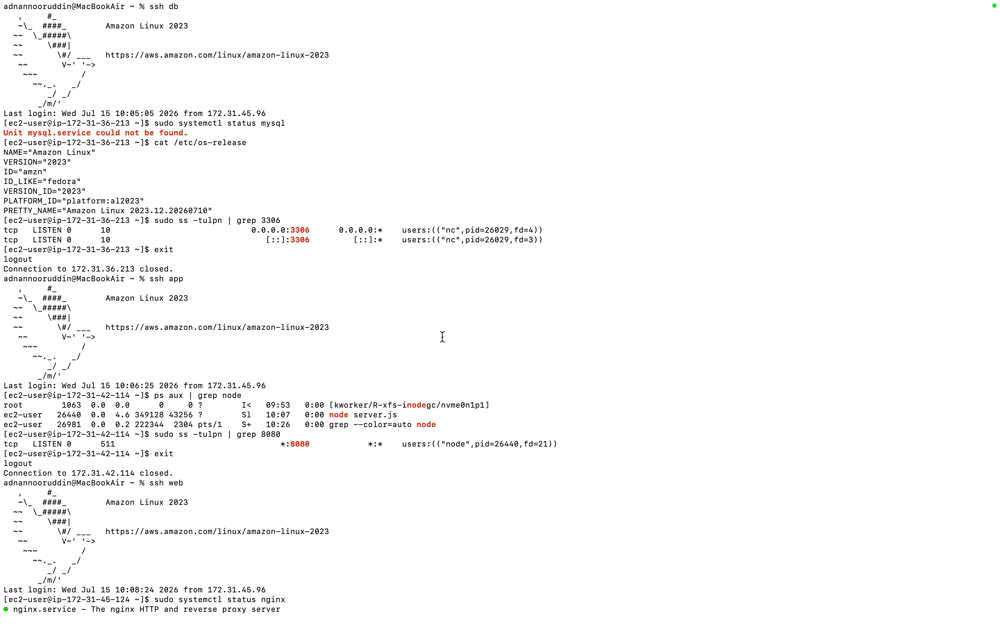
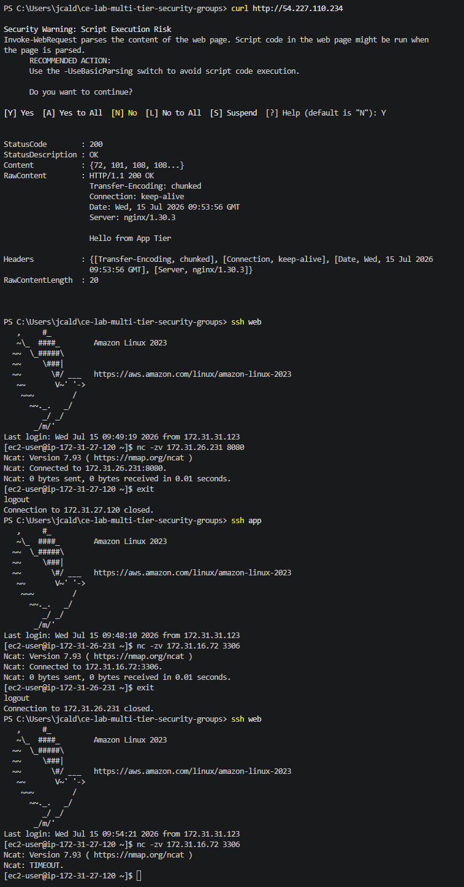
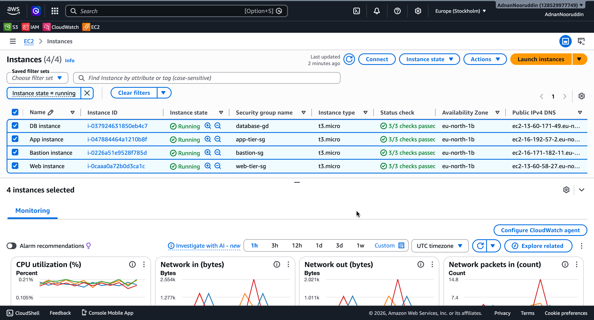

# Configure Multi-Tier Security Groups Lab - Solution

**Student Name:** Julio Cesar Aldana Almanza  
**Date Completed:** 07/15/2026

---

# Environment Details

| Tier | Instance ID | Private IP | Public IP | Security Group |
|------|-------------|------------|-----------|----------------|
| Bastion | i-0c895ee655a365d94 | 172.31.31.123 | 98.91.16.187 — redact if repo is public | bastion-sg |
| Web | i-0bd133dc6e73ed265 | 172.31.27.120 | 54.227.110.234 | web-tier-sg |
| App | i-0718ab9ba0dde0a9d | 172.31.26.231 | 52.23.171.151 | app-tier-sg |
| Database | i-04d3ecca11a828d9a | 172.31.16.72 | 54.90.216.51 | database-sg |

- **Region / VPC:** us-east-1 / vpc-0b0d1aabbc5777895
- **Key Pair:** bootcamp-week2-key.pem
- **My IP (SSH source):** 92.209.213.67/32

---

# Step 1: Create Security Groups

## Screenshot 1 – Security Groups List

Save your screenshot as:

```
Screenshots/01-security-groups-list.png
```


---

- [x] `sg-bastion` created
- [x] `sg-web-tier` created
- [x] `sg-app-tier` created
- [x] `sg-database` created
- [x] Rules reference other **security groups**, not IP ranges (except port 22 on the bastion and 80/443 on the web tier)

### sg-bastion

| Direction | Port | Source / Destination | Purpose |
|-----------|------|----------------------|---------|
| Inbound | [22] | 92.209.213.67/32 | SSH from my laptop |
| Outbound | [22] | sg-web-tier, sg-app-tier, sg-database | Hop to private tiers |

### sg-web-tier

| Direction | Port | Source / Destination | Purpose |
|-----------|------|----------------------|---------|
| Inbound | 80 | 0.0.0.0/0 | Public HTTP |
| Inbound | 443 | 0.0.0.0/0 | Public HTTPS |
| Inbound | 22 | sg-bastion | SSH via bastion only |
| Outbound | 8080 | sg-app-tier | Proxy to app tier |
| Outbound | 443 | 0.0.0.0/0 | Package downloads |

### sg-app-tier

| Direction | Port | Source / Destination | Purpose |
|-----------|------|----------------------|---------|
| Inbound | 8080 | sg-web-tier | App traffic from web tier |
| Inbound | 22 | sg-bastion | SSH via bastion only |
| Outbound | 3306 | sg-database | MySQL queries |
| Outbound | 443 | 0.0.0.0/0 | Package downloads |

### sg-database

| Direction | Port | Source / Destination | Purpose |
|-----------|------|----------------------|---------|
| Inbound | 3306 | sg-app-tier | MySQL from app tier only |
| Inbound | 22 | sg-bastion | SSH via bastion only |
| Outbound | 443 | 0.0.0.0/0 | Package downloads |

---

### Why reference a security group instead of a private IP or CIDR?

**Your Answer**

```
Using security groups makes the process scalable. 
```

---

# Step 2: Launch Instances and Connect Through the Bastion

## Screenshot 2 – Web Tier Security Group Rules

Save your screenshot as:

```
Screenshots/02-web-tier-rules.png
```


---

- [X] 4 instances launched, one security group each
- [X] Connected to the bastion from my laptop
- [X] Reached web / app / db by **private IP** through the bastion

---

### Which connection method did you use?

- [X] ProxyJump
- [ ] Copy key to bastion

---

### My `~/.ssh/config` (or the commands I ran)

```text
Host bastion
    HostName 98.91.16.187
    User ec2-user
    IdentityFile ~/.ssh/bootcamp-week2-key.pem

Host web
    HostName 172.31.27.120
    User ec2-user
    IdentityFile ~/.ssh/bootcamp-week2-key.pem
    ProxyJump bastion

Host app
    HostName 172.31.26.231
    User ec2-user
    IdentityFile ~/.ssh/bootcamp-week2-key.pem
    ProxyJump bastion

Host db
    HostName 172.31.16.72 
    User ec2-user
    IdentityFile ~/.ssh/bootcamp-week2-key.pem
    ProxyJump bastion
```

---

### Why must you target the private tiers by private IP instead of public IP?

**Your Answer**

```
Because the tiers are not public visible, only bastion has access to them through the security groups configured
```

---
# Step 3: Simulate Application Traffic

## Screenshot 3 – Services Running

Save your screenshot as:

```
Screenshots/03-services-running.png
```



---

- [X] Database: `nc -l 3306` loop running (`nmap-ncat` installed)
- [X] App: `server.js` listening on 8080 (`nodejs` installed)
- [X] Web: Nginx installed, proxying `/` to `http://172.31.26.231:8080`, enabled on boot

### Anything that did not start cleanly?

**Your Answer**

```
_______________________________________________________________

_______________________________________________________________

_______________________________________________________________
```

---

# Step 4: Test Traffic Flow

## Screenshot 4 – Traffic Flow Test

Save your screenshot as:

```
Screenshots/04-traffic-flow-test.png
```



---

**Reading results:** *connection refused* = the security group **allowed** the packet but nothing was listening. *Timeout / hang* = the security group **blocked** the packet.

Tick the box if the test did what the **Expected** column says.

| # | Test | Run from | Expected | Got it |
|---|------|----------|----------|--------|
| 1 | `curl http://WEB_PUBLIC_IP` | Laptop | ✅ HTTP 200 | ✅ HTTP 200 |
| 2 | `ssh bastion`, then `ssh WEB_PRIVATE_IP` | Laptop → bastion | ✅ Connects | ✅ Connects |
| 3 | `ssh ec2-user@WEB_PUBLIC_IP` | Laptop | ❌ Timeout | ❌ Timeout |
| 4 | `nc -zv APP_PRIVATE_IP 8080` | Web | ✅ Succeeds | ✅ Succeeds |
| 5 | `nc -zv DB_PRIVATE_IP 3306` | App | ✅ Succeeds | ✅ Succeeds |
| 6 | `nc -zv DB_PRIVATE_IP 3306` | Web | ❌ Timeout | ❌ Timeout |
| 7 | `curl http://WEB_PUBLIC_IP` | Laptop | ✅ "Hello from App Tier" | ✅ "Hello from App Tier" |

---

### Test 6 — How did it fail?

(Timeout is the correct answer. "Connection refused" means the web tier can reach the database and a rule is too permissive.)

- [x] Timed out / hung ✅ Correct
- [ ] Connection refused ⚠️ Rules too permissive

---

### Did every test pass on the first attempt?

- [ ] Yes
- [x] No

If no, what did you have to fix?

```
One security group was not configured correctly. 
Specifically the HTTP port was configured to 0 in the app sg, when it should be 8080.
```

---

# Step 5: Architecture

## Screenshot 5 – Completed Architecture

Save your screenshot as:

```
Screenshots/05-architecture-console.png
```



---

Confirm each communication path.

- [x] Internet → Web on port **80**
- [x] Web → App on port **8080**
- [x] App → Database on port **3306**
- [x] SSH access only through the bastion host
- [x] Web → Database blocked
- [x] Internet → App blocked
- [x] Internet → Database blocked

---

### Instances with no public IP

```
app, web and db
```

---

### Instances reachable from the Internet

```
web
```

---

# Bonus Challenges (Optional)

- [ ] **Challenge 1:** Remove the `443 → 0.0.0.0/0` egress rule from one tier. What broke?

```
_______________________________________________________________
```

- [ ] **Challenge 2:** Attach two security groups to one instance. How do the rules combine?

```
_______________________________________________________________
```

- [ ] **Challenge 3:** Tighten the bastion's inbound SSH to a single `/32` and re-test from another network.

```
_______________________________________________________________
```

- [ ] **Challenge 4:** Recreate the four security groups using the AWS CLI.

```
_______________________________________________________________
```

---

# Reflection

## 1. Why can the application tier reach the database, but the web tier cannot?

```
Because in the sg app and db, it is specified that the app can send request to db and db can receive requests from app.
Web sg does not have that rule. 
```

---

## 2. Why do all private instances only accept SSH from the bastion?

```
Because all private instance have specified to receive SSH only from bastion. 
```

---

## 3. When a connection timed out instead of failing immediately, what was blocking it?

```
The connection due to the security group attached to the instance. 
```

---

## 4. Which security group rule would you never configure in a production environment, and why?

```
Allow access from anywhere to the database. This tier is the most delicate and should be totally secured from attackers. 
```

---

# Key Learnings

### Hardest part of this lab

```
Understand the connection between tiers.
```

---

### One thing I will do differently in future AWS deployments

```
Double check security group rules to avoid issues during connections. 
```

---

# Checklist

- [x] 4 security groups created with security group references
- [x] 4 EC2 instances launched
- [x] SSH works only through the bastion
- [x] Required services running on all tiers
- [x] All 7 connectivity tests completed
- [x] Blocked traffic confirmed with timeouts
- [x] End-to-end application test successful
- [x] Architecture documented
- [x] All required screenshots captured
- [x] Reflection questions completed
- [x] Changes committed to Git
- [x] Pull Request created


